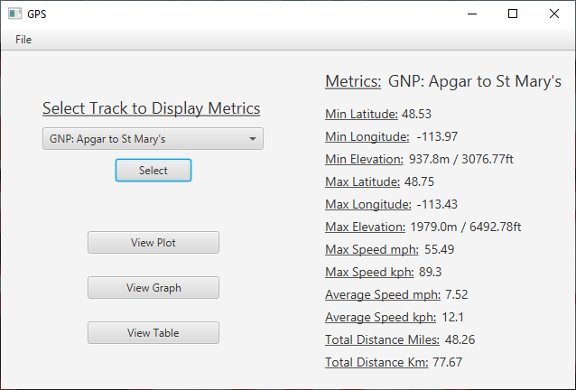
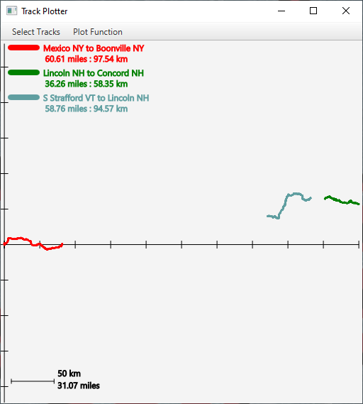
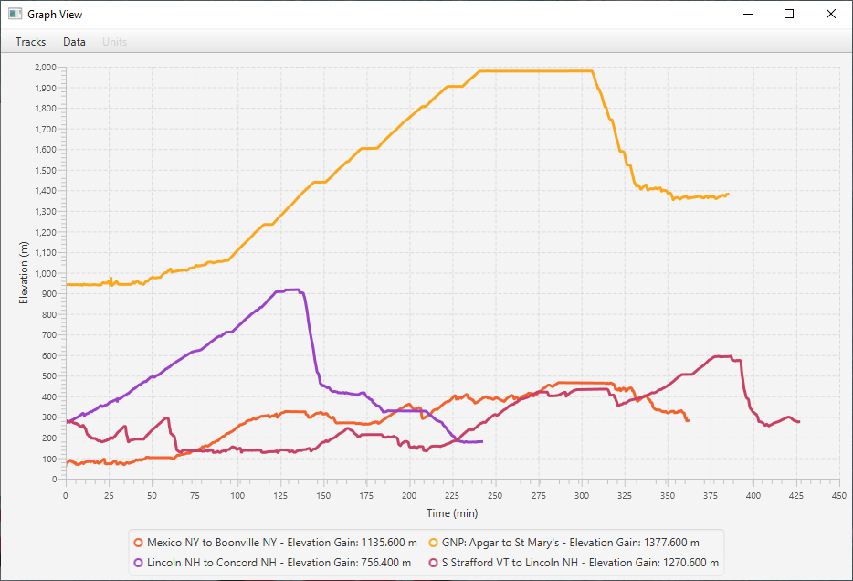
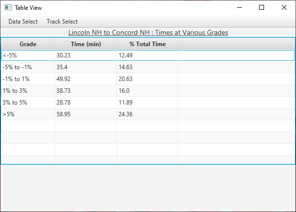

# GPS-App
SE2030 and SE2040 (Software Engineering Tools and Practices, Software Engineering Process I) project.
  
Takes in .gpx/.txt files containing gps data and displays various metrics, plots, and graphs from the data. This project was used to further practice Git and team based coding as well as an introduction to Scrum practices.
  
Below are screenshots respectively of the main screen, the plotting functionality, the graphing functionality, and the table functionality of our app.

  

  

  

  
